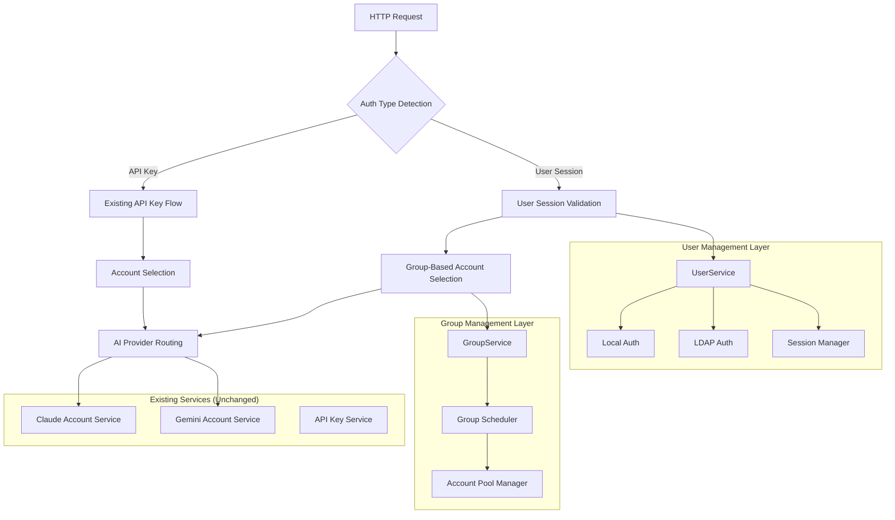

# Design Document

## Overview

The User Management System design transforms the Claude Relay Service from a single-tenant API proxy into a multi-tenant platform while maintaining 100% backward compatibility. The architecture implements a dual authentication model where existing API key workflows continue unchanged, while new user-based authentication provides organizational access control.

The system introduces three core architectural layers: **User Services** (authentication and session management), **Group Scheduling** (intelligent load balancing), and **Administrative Interfaces** (web-based management). These layers integrate seamlessly with existing service components without disrupting current functionality.

## Steering Document Alignment

### Technical Standards (tech.md)
*Note: No existing steering documents found. Following established codebase patterns:*

- **Service Layer Pattern**: New user services follow the same structure as `claudeAccountService.js` and `apiKeyService.js`
- **Database Adapter Pattern**: User data management extends the existing `RedisAdapter.js` architecture
- **Middleware Pattern**: Authentication middleware integrates with the existing `auth.js` middleware stack
- **Configuration Pattern**: New features use the same configuration structure as existing services

### Project Structure (structure.md)
*Following existing project organization:*

- **Services**: `src/services/userService.js`, `src/services/groupService.js`
- **Middleware**: Extensions to `src/middleware/auth.js`
- **Routes**: Extensions to `src/routes/admin.js`
- **Models**: Extensions to `src/models/database/RedisAdapter.js`
- **Frontend**: `web/admin-spa/src/views/users/`, `web/admin-spa/src/views/groups/`

## Code Reuse Analysis

### Existing Components to Leverage

- **`apiKeyService.js`**: Authentication patterns and session management concepts will be adapted for user sessions
- **`RedisAdapter.js`**: Data storage patterns will be extended for user and group data with the same encryption strategies
- **`auth.js` middleware**: Current authentication flow will be enhanced to support dual authentication modes
- **`claudeAccountService.js`**: Account selection algorithms will be adapted for group-based account routing
- **`twoFactorAuthService.js`**: Existing 2FA infrastructure will be integrated for administrative operations
- **Web admin components**: Existing Vue.js components and styling will be extended for user/group management

### Integration Points

- **Authentication Middleware**: Extends current `authenticateApiKey()` to include `authenticateUserSession()` without affecting existing flows
- **Account Selection**: Group-based routing integrates with existing `claudeAccountService.selectAccount()` and `geminiAccountService.selectAccount()`
- **Database Schema**: User and group data uses existing Redis patterns with `user:{id}` and `group:{id}` key structures
- **Admin Routes**: New user/group endpoints extend the existing `/admin/*` route structure
- **Configuration**: New settings integrate with existing `config/config.js` structure with feature flags

## Architecture

The design implements a **Layered Authentication Architecture** with **Pluggable Authentication Strategies** and **Group-Based Resource Allocation**. The system maintains strict separation of concerns while ensuring existing workflows remain completely unaffected.

### Modular Design Principles

- **Single File Responsibility**: `userService.js` handles only user CRUD and authentication, `groupService.js` manages only group operations
- **Component Isolation**: Authentication strategies (local, LDAP) are implemented as separate, swappable modules
- **Service Layer Separation**: Clear boundaries between data access (Redis operations), business logic (authentication/authorization), and presentation (API routes)
- **Utility Modularity**: Password hashing, session management, and LDAP connections are separate utility modules



## Components and Interfaces

### UserService Component

- **Purpose:** Manages user authentication, session management, and LDAP integration
- **Interfaces:**
  - `authenticateLocal(username, password)` → Promise<AuthResult>
  - `authenticateLDAP(username, password)` → Promise<AuthResult>
  - `createUserSession(userId, loginInfo)` → Promise<SessionToken>
  - `validateUserSession(token)` → Promise<UserContext>
  - `createUser(userData)` → Promise<User>
- **Dependencies:** RedisAdapter, bcryptjs, ldapjs, session utilities
- **Reuses:** Encryption utilities from `claudeAccountService.js`, error handling patterns from `apiKeyService.js`

### GroupService Component

- **Purpose:** Manages user groups and group-based account assignments
- **Interfaces:**
  - `createGroup(groupData)` → Promise<Group>
  - `assignUserToGroup(userId, groupId)` → Promise<void>
  - `getGroupAccounts(groupId, provider)` → Promise<Account[]>
  - `selectAccountForGroup(userId, provider)` → Promise<Account>
- **Dependencies:** RedisAdapter, existing account services
- **Reuses:** Account selection algorithms from `claudeAccountService.js`, load balancing logic

### Enhanced Auth Middleware

- **Purpose:** Provides dual authentication support maintaining backward compatibility
- **Interfaces:**
  - `authenticateApiKey()` (unchanged)
  - `authenticateUserSession()` (new)
  - `authenticateRequest()` (unified handler)
- **Dependencies:** UserService, existing API key validation
- **Reuses:** All existing authentication logic, rate limiting, and security features

### LDAP Integration Component

- **Purpose:** Handles LDAP server connections and user synchronization
- **Interfaces:**
  - `connectLDAP(config)` → Promise<LDAPConnection>
  - `authenticateUser(username, password)` → Promise<LDAPUser>
  - `syncUserAttributes(ldapUser)` → Promise<UserData>
- **Dependencies:** ldapjs library, connection pooling utilities
- **Reuses:** Proxy configuration patterns from `claudeAccountService.js`

## Data Models

### User Model
```javascript
{
  id: "uuid-string",              // Unique user identifier
  username: "string",             // Unique username
  email: "string",                // User email (optional)
  passwordHash: "string",         // bcrypt hashed password (local auth only)
  isActive: boolean,              // Account status
  role: "admin|user|viewer",      // User role
  groups: ["group-id-1", ...],    // Array of group IDs
  authMethod: "local|ldap",       // Authentication method
  ldapDN: "string",               // LDAP Distinguished Name (LDAP users only)
  lastLogin: "ISO-string",        // Last successful login
  loginAttempts: number,          // Failed login counter
  lockedUntil: "ISO-string",      // Account lock expiration
  createdAt: "ISO-string",        // Account creation time
  updatedAt: "ISO-string"         // Last update time
}
```

### Group Model
```javascript
{
  id: "uuid-string",              // Unique group identifier
  name: "string",                 // Group display name
  description: "string",          // Group description
  isActive: boolean,              // Group status
  members: ["user-id-1", ...],    // Array of user IDs
  claudeAccounts: ["acc-1", ...], // Assigned Claude account IDs
  geminiAccounts: ["acc-1", ...], // Assigned Gemini account IDs
  azureAccounts: ["acc-1", ...],  // Assigned Azure OpenAI account IDs
  schedulingStrategy: "random|round_robin|weighted", // Load balancing method
  permissions: {                  // Group-level permissions
    models: ["claude-3-opus", ...], // Allowed models
    features: ["streaming", ...]     // Allowed features
  },
  createdAt: "ISO-string",
  updatedAt: "ISO-string"
}
```

### UserSession Model
```javascript
{
  token: "jwt-token-string",      // JWT session token
  userId: "uuid-string",          // Associated user ID
  username: "string",             // Username (for quick access)
  role: "string",                 // User role (cached)
  groups: ["group-id", ...],      // User groups (cached)
  loginTime: "ISO-string",        // Session creation time
  lastActivity: "ISO-string",     // Last request time
  expiresAt: "ISO-string",        // Session expiration
  ipAddress: "string",            // Client IP (security)
  userAgent: "string"             // Client info (security)
}
```

## Error Handling

### Error Scenarios

1. **LDAP Server Unavailable**
   - **Handling:** Graceful fallback to cached credentials or local authentication based on configuration
   - **User Impact:** Login may be slower, clear messaging about authentication method fallback
   - **Recovery:** Automatic retry with exponential backoff, admin notification for extended outages

2. **User Session Expired**
   - **Handling:** Clear session data, redirect to login with preservation of intended action
   - **User Impact:** Seamless re-authentication flow with return to original request
   - **Recovery:** Automatic session refresh for long-running operations where appropriate

3. **Group Account Pool Empty**
   - **Handling:** Fallback to global account pool if configured, otherwise clear error message
   - **User Impact:** Request may be routed differently or fail with clear explanation
   - **Recovery:** Automatic retry when accounts become available, admin notification

4. **Dual Authentication Conflict**
   - **Handling:** User session takes precedence, log the dual authentication attempt for audit
   - **User Impact:** Request processes normally with user context
   - **Recovery:** Clear documentation on authentication precedence rules

## Testing Strategy

### Unit Testing

- **UserService Authentication**: Mock LDAP connections, test password validation, session creation/validation
- **GroupService Logic**: Test account selection algorithms, group membership operations
- **Auth Middleware**: Test dual authentication flows, ensure API key paths remain unchanged
- **Password Security**: Verify bcrypt implementation, session token security
- **Target Coverage**: 85%+ for new user management components

### Integration Testing

- **Authentication Flows**: Test complete login/logout cycles for both local and LDAP users
- **Account Routing**: Verify group-based account selection works with existing provider services
- **Data Persistence**: Test user/group CRUD operations with Redis
- **Backward Compatibility**: Comprehensive tests ensuring existing API key flows are unchanged
- **Session Management**: Test session lifecycle, expiration, and cleanup processes

### End-to-End Testing

- **User Registration to API Usage**: Complete workflow from admin creating user to making AI API requests
- **Group Management**: Create group, assign users, verify request routing through group accounts
- **LDAP Integration**: Full LDAP authentication flow with real/mock LDAP server
- **Admin Interface**: Web UI testing for user/group management operations
- **Mixed Authentication**: Scenarios with both API key and user session requests in the same system