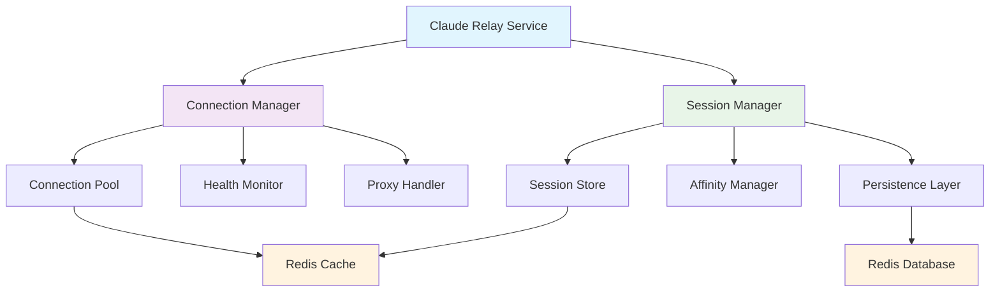
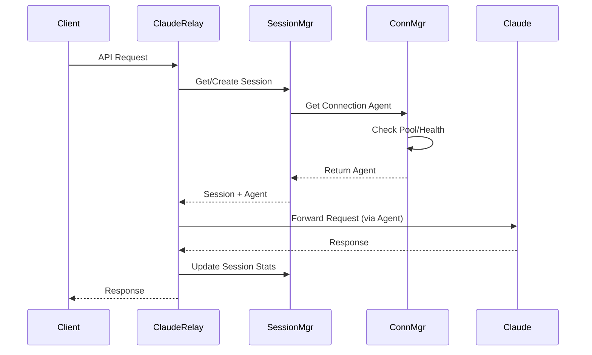

# 连接管理器和会话管理器架构文档

## 📋 概述

本文档描述了Claude Relay Service中新实现的连接管理器（ConnectionManager）和会话管理器（SessionManager）的架构设计、核心功能和集成方式。这两个组件是提升系统稳定性、性能和用户体验的关键基础设施。

## 🏗️ 系统架构

### 核心组件关系图



### 数据流图



## 🔗 连接管理器 (ConnectionManager)

### 核心特性

#### 1. 连接池管理
- **智能连接复用**：HTTP/HTTPS连接的高效复用机制
- **动态池大小调整**：基于负载自动调整连接池大小
- **Keep-Alive优化**：长连接维护和超时管理
- **资源隔离**：不同目标和代理的连接隔离

#### 2. 健康监控
- **实时健康检查**：定期检测连接可用性
- **故障检测**：多维度故障识别和恢复
- **智能重试**：指数退避重试策略
- **自动切换**：故障连接的自动切换和恢复

#### 3. 代理支持
- **多协议支持**：SOCKS5、HTTP/HTTPS代理
- **代理连接测试**：连接建立前的代理可用性验证
- **代理连接池**：基于代理配置的独立连接池
- **故障切换**：代理故障时的自动处理

#### 4. 性能优化
- **连接预热**：服务启动时的连接预建立
- **缓存机制**：连接对象的LRU缓存
- **负载感知**：基于系统负载的动态调整
- **监控指标**：详细的性能和使用指标

### 配置参数

```javascript
const config = {
  // 连接池配置
  maxSockets: 50,           // 最大连接数
  maxFreeSockets: 10,       // 最大空闲连接数
  timeout: 30000,           // 连接超时时间
  keepAlive: true,          // 启用Keep-Alive
  keepAliveMsecs: 30000,    // Keep-Alive间隔
  
  // 健康检查配置
  healthCheckInterval: 60000,    // 健康检查间隔
  connectionTimeout: 10000,      // 连接超时
  healthCheckTimeout: 5000,      // 健康检查超时
  
  // 故障检测配置
  maxFailures: 3,           // 最大失败次数
  failureWindow: 300000,    // 故障窗口期
  recoveryTime: 60000,      // 恢复时间
  
  // 动态调整配置
  loadThreshold: 0.8,       // 负载阈值
  scaleUpFactor: 1.5,       // 扩容因子
  scaleDownFactor: 0.7,     // 缩容因子
  minConnections: 2,        // 最小连接数
  maxConnections: 100       // 最大连接数
}
```

### API接口

```javascript
// 获取连接代理
const agent = await connectionManager.getConnectionAgent({
  target: 'api.anthropic.com',
  proxy: proxyConfig,
  accountId: 'account-123',
  sessionId: 'session-456',
  forceNew: false
})

// 获取连接统计
const stats = connectionManager.getConnectionStats()

// 重置连接
await connectionManager.resetConnection(connectionKey)
```

## 📝 会话管理器 (SessionManager)

### 核心特性

#### 1. 会话持久化
- **多存储后端**：Redis、Database或混合存储
- **自动同步**：内存与持久存储的智能同步
- **数据一致性**：跨进程会话数据一致性保证
- **TTL管理**：会话生命周期的自动管理

#### 2. 会话亲和性
- **Sticky Sessions**：请求到会话的粘性映射
- **负载均衡**：会话级别的负载分配
- **故障转移**：会话级别的故障处理
- **性能优化**：基于亲和性的连接优化

#### 3. 状态管理
- **生命周期管理**：会话创建、激活、过期、清理
- **状态追踪**：请求状态、错误计数、使用统计
- **上下文保持**：跨请求的会话上下文维护
- **恢复机制**：断线重连后的状态恢复

#### 4. 缓存优化
- **多层缓存**：内存缓存 + 持久缓存
- **LRU策略**：基于访问频率的缓存淘汰
- **预加载**：常用会话的预加载机制
- **智能清理**：过期会话的自动清理

### 配置参数

```javascript
const config = {
  // 会话配置
  defaultTTL: 3600,         // 默认TTL（秒）
  maxTTL: 86400,            // 最大TTL（秒）
  cleanupInterval: 300000,   // 清理间隔（毫秒）
  
  // 持久化配置
  persistenceStrategy: 'redis',  // 存储策略
  batchSize: 100,           // 批量操作大小
  syncInterval: 60000,      // 同步间隔
  
  // 缓存配置
  memoryCache: true,        // 启用内存缓存
  memoryCacheSize: 10000,   // 缓存大小
  memoryCacheTTL: 300,      // 缓存TTL
  
  // 亲和性配置
  stickySession: true,      // 启用会话亲和性
  affinityTTL: 1800,        // 亲和性TTL
  maxAffinityRetries: 3,    // 最大重试次数
  
  // 恢复配置
  recoveryTimeout: 30000,   // 恢复超时
  maxRecoveryAttempts: 3,   // 最大恢复尝试
  recoveryBackoff: 5000     // 恢复退避时间
}
```

### API接口

```javascript
// 创建会话
const session = await sessionManager.createSession({
  userId: 'user-123',
  accountId: 'account-456',
  apiKeyId: 'key-789',
  ttl: 3600,
  metadata: { custom: 'data' }
})

// 获取会话
const session = await sessionManager.getSession(sessionId)

// 更新会话
await sessionManager.updateSession(sessionId, {
  status: 'active',
  metadata: { updated: true }
})

// 获取会话连接
const agent = await sessionManager.getSessionConnection(
  sessionId, 
  connectionOptions
)

// 查找会话
const sessions = sessionManager.findSessions({
  userId: 'user-123',
  status: 'active'
})

// 删除会话
await sessionManager.deleteSession(sessionId)
```

## 🔄 集成架构

### Claude Relay Service集成

```javascript
// 在claudeRelayService.js中的集成示例

class ClaudeRelayService {
  async relayRequest(requestBody, apiKeyData, clientRequest, clientResponse, clientHeaders) {
    // 1. 创建或获取会话
    const sessionId = sessionHelper.generateSessionHash(requestBody)
    let session = await sessionManager.getSession(sessionId)
    
    if (!session) {
      session = await sessionManager.createSession({
        sessionId,
        accountId,
        apiKeyId: apiKeyData.id,
        clientInfo: { userAgent, requestId },
        metadata: { model, stream }
      })
    }
    
    // 2. 获取优化的连接代理
    const proxyAgent = await this._getOptimizedProxyAgent(accountId, sessionId)
    
    // 3. 发送请求并更新会话状态
    const response = await this._makeClaudeRequest(...)
    
    // 4. 更新会话统计
    await sessionManager.updateSession(sessionId, {
      status: response.statusCode === 200 ? 'completed' : 'error',
      lastError: response.statusCode !== 200 ? `HTTP ${response.statusCode}` : null
    })
    
    return response
  }
  
  async _getOptimizedProxyAgent(accountId, sessionId) {
    // 使用连接管理器获取优化的连接
    return await connectionManager.getConnectionAgent({
      target: 'api.anthropic.com',
      proxy: account?.proxy || null,
      accountId,
      sessionId
    })
  }
}
```

### 数据流优化

1. **请求路由**：基于会话亲和性的智能路由
2. **连接复用**：同会话请求的连接复用
3. **故障处理**：连接和会话级别的故障处理
4. **性能监控**：实时性能指标收集和分析

## 📊 性能基准和监控

### 关键指标

#### 连接管理器指标
- **连接池利用率**：`activeConnections / maxConnections`
- **缓存命中率**：`cacheHits / (cacheHits + cacheMisses)`
- **连接错误率**：`totalErrors / totalRequests`
- **平均连接时间**：`totalConnectionTime / totalConnections`
- **健康连接比例**：`healthyConnections / totalConnections`

#### 会话管理器指标
- **会话存活率**：`activeSessions / createdSessions`
- **会话恢复成功率**：`restoredSessions / recoveryAttempts`
- **会话缓存命中率**：`sessionCacheHits / sessionRequests`
- **平均会话持续时间**：`totalSessionTime / completedSessions`
- **会话亲和性成功率**：`affinityHits / affinityRequests`

### 性能基准建议

#### 生产环境推荐配置

```javascript
// 高负载环境配置
const productionConfig = {
  connectionManager: {
    maxSockets: 100,          // 增加最大连接数
    maxFreeSockets: 20,       // 增加空闲连接池
    healthCheckInterval: 30000, // 更频繁的健康检查
    maxFailures: 5,           // 提高故障容忍度
    recoveryTime: 120000      // 延长恢复时间
  },
  
  sessionManager: {
    memoryCacheSize: 50000,   // 增加内存缓存
    syncInterval: 30000,      // 更频繁的同步
    batchSize: 200,           // 增加批处理大小
    defaultTTL: 7200,         // 延长会话TTL
    affinityTTL: 3600         // 延长亲和性TTL
  }
}

// 开发/测试环境配置
const developmentConfig = {
  connectionManager: {
    maxSockets: 20,
    maxFreeSockets: 5,
    healthCheckInterval: 60000,
    maxFailures: 2,
    recoveryTime: 60000
  },
  
  sessionManager: {
    memoryCacheSize: 5000,
    syncInterval: 60000,
    batchSize: 50,
    defaultTTL: 1800,
    affinityTTL: 900
  }
}
```

#### 监控阈值建议

```javascript
const monitoringThresholds = {
  // 连接管理器告警阈值
  connection: {
    errorRate: 0.05,          // 5% 错误率告警
    cacheHitRate: 0.8,        // 80% 缓存命中率预期
    poolUtilization: 0.9,     // 90% 池利用率告警
    avgConnectionTime: 5000,  // 5秒平均连接时间告警
    healthyRatio: 0.95        // 95% 健康连接比例预期
  },
  
  // 会话管理器告警阈值
  session: {
    survivalRate: 0.9,        // 90% 会话存活率预期
    recoveryRate: 0.95,       // 95% 恢复成功率预期
    cacheHitRate: 0.85,       // 85% 缓存命中率预期
    avgSessionDuration: 1800, // 30分钟平均会话时长预期
    affinityRate: 0.9         // 90% 亲和性成功率预期
  }
}
```

### 容量规划

#### 内存使用估算

```javascript
const memoryEstimation = {
  // 连接管理器内存使用
  connectionManager: {
    perConnection: '~2KB',    // 每个连接对象
    cacheOverhead: '~500B',   // 每个缓存条目
    totalFor1000Conn: '~2.5MB'
  },
  
  // 会话管理器内存使用
  sessionManager: {
    perSession: '~1KB',       // 每个会话对象
    cacheOverhead: '~300B',   // 每个缓存条目
    totalFor10000Session: '~13MB'
  }
}
```

#### Redis存储估算

```javascript
const redisEstimation = {
  // 会话数据存储
  sessionData: {
    perSession: '~800B',      // 每个会话数据
    totalFor100kSession: '~80MB'
  },
  
  // 连接指标存储
  connectionMetrics: {
    perMetric: '~500B',       // 每个指标记录
    retentionPeriod: '24h',   // 保留期限
    totalEstimate: '~50MB/day'
  }
}
```

## 🛠️ 运维和故障排除

### 常见问题排查

#### 1. 连接池耗尽
**症状**：请求响应时间增加，出现连接超时错误
**排查步骤**：
```bash
# 检查连接池状态
node -e "console.log(require('./src/services/connectionManager').connectionManager.getConnectionStats())"

# 检查系统资源
netstat -an | grep :443 | wc -l  # 检查HTTPS连接数
lsof -p <pid> | grep socket | wc -l  # 检查进程socket数
```

#### 2. 会话数据不一致
**症状**：会话状态异常，用户体验中断
**排查步骤**：
```bash
# 检查Redis中的会话数据
redis-cli keys "session:*" | wc -l

# 检查会话管理器状态
node -e "console.log(require('./src/services/sessionManager').sessionManager.getSessionStats())"
```

#### 3. 代理连接问题
**症状**：特定账户请求失败，代理相关错误
**排查步骤**：
```bash
# 测试代理连接
curl -x <proxy_host>:<proxy_port> https://api.anthropic.com/

# 检查代理配置
node -e "console.log(require('./src/services/claudeAccountService').getAllAccounts().then(a => a.filter(acc => acc.proxy)))"
```

### 维护任务

#### 日常维护
```bash
# 检查系统状态
npm run test:connection-session

# 清理过期数据
redis-cli eval "return redis.call('del', unpack(redis.call('keys', 'session:*')))" 0

# 重启连接池（如需要）
node -e "require('./src/services/connectionManager').connectionManager.resetConnection('all')"
```

#### 性能调优
```bash
# 监控连接使用情况
watch -n 5 "netstat -an | grep :443 | wc -l"

# 监控内存使用
watch -n 5 "ps aux | grep node | grep claude"

# 监控Redis使用
redis-cli info memory
```

## 📈 扩展和未来发展

### 计划增强功能

1. **智能负载均衡**
   - 基于响应时间的动态路由
   - 地理位置感知的连接优化
   - AI驱动的容量预测

2. **高级监控**
   - 分布式链路追踪
   - 实时性能仪表板
   - 自动异常检测和告警

3. **容错增强**
   - 多区域故障转移
   - 渐进式流量恢复
   - 自动容量扩缩

4. **安全增强**
   - 连接加密增强
   - 会话安全验证
   - 审计日志完善

### 架构演进路径

```mermaid
graph LR
    A[当前架构v1.0] --> B[增强监控v1.1]
    B --> C[智能负载v1.2]
    C --> D[分布式部署v2.0]
    D --> E[云原生架构v3.0]
    
    style A fill:#e8f5e8
    style E fill:#e1f5fe
```



## 📚 相关文档

- [Claude Relay Service架构文档](../CLAUDE.md)
- [性能优化指南](./performance-optimization.md)
- [监控和告警配置](./monitoring-setup.md)
- [故障排除手册](./troubleshooting.md)

---

**文档版本**: v1.0.0  
**最后更新**: 2025-09-10  
**维护团队**: Claude Code Infrastructure Team